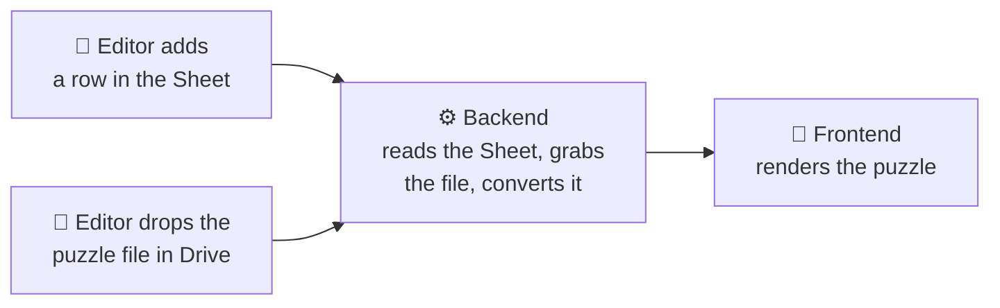

# Daily Bruin Crossword

The Daily Bruin's online crossword — both a full-size puzzle and a smaller daily "mini."
Readers solve right in the browser; editors publish new puzzles from a Google Sheet with
no code involved.

**Live:**
- Crossword — https://crossword.dailybruin.com/
- Mini — https://crossword.dailybruin.com/mini
- On the main site: [crossword](https://dailybruin.com/category/games/crossword) ·
  [mini](https://dailybruin.com/category/games/mini-crossword)

---

## What's in here

The project is two small apps that live in one repo:

- **`frontend/`** — a React app (built with Vite) that draws the puzzle grid and lets people
  solve it. This is what readers see.
- **`backend/`** — a tiny Express server with one job: hand the frontend the right puzzle as
  data. It also powers the archive of past puzzles.

Both run as separate services on Kubernetes. There's **no database and no login** to manage.

---

## How it works (the short version)

Puzzles are stored in two ordinary Google tools instead of a database:

- a **Google Sheet** is the list of puzzles (one row each), and
- a **Google Drive folder** holds the actual puzzle files.

When someone opens the site, the backend reads the Sheet, finds the puzzle that should be
showing, downloads its file from Drive, turns it into the format the grid understands, and
sends it to the frontend.



A few things this setup gives us:

- **Editors never touch code.** Adding a row publishes a puzzle.
- **Scheduling.** A row can carry a date and time, and the puzzle goes live on its own once
  that time arrives.
- **An archive.** Past puzzles stay reachable — there's a "Previous Puzzles" page and a
  calendar for browsing them, one for the mini and one for the full crossword.
- **Nothing secret to maintain.** The Sheet and Drive files are read-only public, so there
  are no passwords or keys in the app that could expire.

For the full editor workflow and the day-to-day maintenance details, see
**[MAINTAINING.md](./MAINTAINING.md)**.

---

## Running it locally

You'll need [Node.js](https://nodejs.org) (version 18 or newer). The frontend and backend
run as two separate processes, so use two terminal windows.

**1. Start the backend** (serves puzzle data on port 3000):

```bash
cd backend
npm install
# Point it at the published crossword Sheet. The URL isn't a secret — it's in
# backend/crossword-backend-dply.yaml under CROSSWORD_SHEET_URL.
CROSSWORD_SHEET_URL="<published-sheet-csv-url>" node index.js
```

**2. Start the frontend** (the site itself, on port 5173):

```bash
cd frontend
npm install
npm run dev
```

The frontend needs to know where the backend is. Create a file called **`frontend/.env.local`**
containing:

```
VITE_BACKEND_DOMAIN="http://localhost:3000"
```

Then open the printed `http://localhost:5173` address. That's it — you're running the whole
site locally against the real puzzle data.

> Tip: `frontend/.env.local` is for local use only and is kept out of the production build,
> so it's safe to leave it in place.

### Tests

The backend has a small test suite (mostly around scheduling and date handling):

```bash
cd backend && npm test
```

---

## Deploying

Deploys are **manual** — there's no automated pipeline, and merging to `main` does not deploy
anything. When you're ready to ship, run the deploy script for whichever part changed:

```bash
cd backend && ./deploy.sh     # backend changed
cd frontend && ./deploy.sh    # frontend changed
```

Each one builds the app, pushes it, and rolls it out on Kubernetes, so you need `docker` and
`kubectl` set up for the cluster. Full details — verifying, reverting, and the ownership notes
that keep this running long-term — are in **[MAINTAINING.md](./MAINTAINING.md)**.

---

## Credits

Built on [react-crossword](https://github.com/JaredReisinger/react-crossword) by Jared
Reisinger (MIT License). Some puzzle content is adapted from *The Crossword Puzzle Book*
(1924), courtesy of Project Gutenberg.
